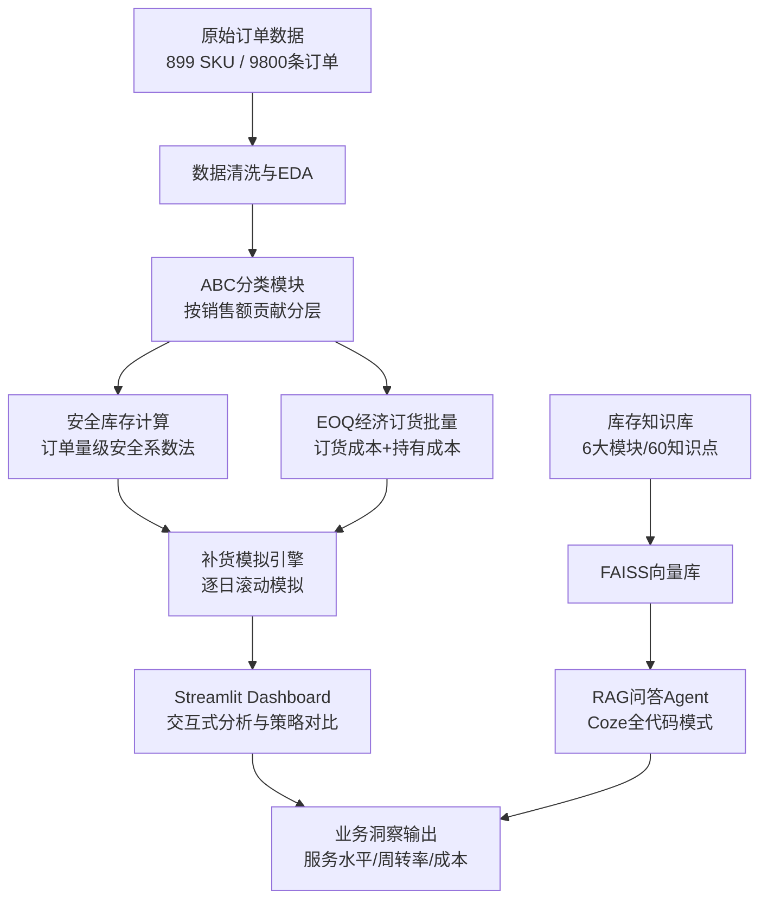

# 智能库存分析与补货模拟系统

> 基于899个SKU模拟订单数据（参考公开数据集特征构建，用于方法验证），构建从数据分析、库存策略优化到智能补货模拟 + RAG问答Agent的端到端库存管理系统。

---

## ✨ 项目亮点

- 🎯 **间歇性需求建模**：针对年均仅2-3次订单的SKU，创新采用"订单量级安全系数法"替代经典正态分布模型，有效解决低频需求下安全库存估算失真问题
- 📊 **ABC差异化管理**：按销售额贡献将899个SKU分为A/B/C三类，配套差异化服务水平与库存策略，实现资源精准投放
- 🔄 **全链路补货模拟**：基于历史订单数据构建逐日补货模拟引擎，量化验证策略效果——整体服务水平93.79%，库存周转率1.75次/年
- 🖥️ **交互式Dashboard**：Streamlit构建可视化仪表盘，支持策略参数实时调整、多维度筛选对比、一键导出分析结果
- 🤖 **RAG智能问答Agent**：基于Coze全代码模式搭建库存知识问答系统，FAISS向量库检索，覆盖6大模块60个知识点

---

## 🛠️ 技术栈

| 类别 | 技术 |
|------|------|
| **数据处理** | Python 3.x, pandas, numpy |
| **数据分析** | scipy, statsmodels |
| **可视化** | matplotlib, seaborn, plotly |
| **Web应用** | Streamlit |
| **向量检索** | FAISS, sentence-transformers |
| **智能体** | Coze 全代码模式, RAG |
| **版本控制** | Git |

---

## 🏗️ 项目架构



**数据流说明**：原始订单 → 清洗与特征工程 → ABC分类 → 安全库存 + EOQ计算 → 补货模拟验证 → Dashboard展示 + 问答Agent辅助决策

---

## 📈 核心成果

| 指标 | 数值 | 说明 |
|------|------|------|
| **整体服务水平** | 93.79% | 满足率 = 1 - 缺货量/需求量 |
| 　├ A类SKU | 99.79% | 高价值品类，高服务水平保障 |
| 　├ B类SKU | 93.50% | 中等价值，平衡服务与成本 |
| 　└ C类SKU | 87.09% | 低价值品类，控制库存成本 |
| **库存周转率** | 1.75次/年 | 年销售成本 / 平均库存价值 |
| **SKU覆盖率** | 100% | 899个SKU全部纳入策略管理 |
| **知识库覆盖** | 6模块/60知识点 | 支撑RAG智能问答 |

---

## 📁 目录结构

```
智能库存分析与补货模拟系统/
├── src/                          # 核心算法层（不依赖 Streamlit，可独立测试）
│   ├── __init__.py               # 包声明
│   ├── config.py                 # 默认参数与路径常量
│   ├── data_loader.py            # 数据读取（自动定位项目根目录）
│   ├── abc.py                    # ABC 分类
│   ├── inventory_params.py       # 安全库存、ROP、EOQ 计算
│   ├── simulation.py             # 补货模拟引擎
│   ├── forecast.py               # 需求预测（Croston / SMA）
│   └── analysis.py               # 汇总、对比与导出数据
├── Dashboard/
│   └── 智能库存分析.py            # Streamlit 交互式仪表盘（仅 UI，调用 src）
├── scripts/
│   ├── run_analysis.py           # 一键运行完整分析（TODO）
│   └── regression_check.py       # 回归验证（基线对比）
├── tests/
│   ├── __init__.py
│   ├── test_abc.py               # ABC 分类测试
│   ├── test_inventory_params.py   # 库存参数测试
│   ├── test_simulation.py         # 模拟引擎测试
│   └── test_forecast.py           # 需求预测测试
├── sql/
│   └── 库存分析_SQL示例.sql        # 5 个业务查询示例
├── 数据/
│   ├── df_cleaned.pkl            # 清洗后数据
│   └── train.csv                 # 原始数据
├── 库存问答Agent/                 # Coze RAG Agent 配置与知识库
├── 项目文档/                      # 简历写法指南、STAR话术、面试准备
├── notebooks/                    # Jupyter 探索笔记
├── README.md
└── requirements.txt
```

---

## 🚀 快速开始

### 环境要求
- Python 3.9+
- pip

### 安装依赖

```bash
pip install -r requirements.txt
```

### 运行 Streamlit Dashboard

```bash
cd 智能库存分析与补货模拟系统
python -m streamlit run Dashboard/智能库存分析.py
```

启动后访问 http://localhost:8501 即可使用交互式仪表盘。

### 运行回归验证

```bash
python scripts/regression_check.py
```

### 运行单元测试

```bash
python -m unittest discover tests -v
```

### 其他方式

也可以直接使用 `streamlit run Dashboard/智能库存分析.py`（如已安装 streamlit 命令），但需注意数据文件路径会自动定位，无需 cd 到数据目录。

---

## 🧩 模块说明

### 1. EDA探索性数据分析
- 数据清洗：处理缺失值、异常值、时间格式统一
- 需求特征分析：订单间隔分布、订单量分布、SKU活跃度分析
- 关键发现：85%以上SKU年均订单≤3次，典型间歇性需求特征

### 2. ABC分类
- 按SKU年度销售额降序排列，累计占比分层
- A类（前20%销售额占比）：364个SKU，贡献69.9%销售额
- B类（中间30%）：249个SKU，贡献20%销售额
- C类（后50%）：286个SKU，贡献10.1%销售额

### 3. 安全库存模型
- **创新方案**：订单量级安全系数法
  - 公式：安全库存 = 平均单次订单量 × 安全系数
  - A类系数2.0，B类系数1.0，C类系数0.5
- 解决间歇性需求下需求率/提前期波动的经典假设不成立问题

### 4. EOQ经济订货批量
- 订货成本：50元/次
- 持有成本率：25%/年
- 公式：EOQ = √(2DS/H)
- 为每个SKU计算最优订货批量

### 5. 补货模拟引擎
- 逐日滚动模拟，基于再订货点（ROP）触发补货
- 考虑补货提前期、在途库存、可用库存
- 输出每日库存水位、缺货量、订货记录
- 支持不同策略参数的对比验证

### 6. Streamlit Dashboard
- 数据总览：SKU分布、销售趋势、库存概况
- 策略对比：调整安全系数，实时观察服务水平与库存变化
- 多维度筛选：按ABC分类、SKU、时间段筛选
- 数据导出：分析结果一键导出Excel

### 7. RAG库存问答Agent
- 知识库覆盖：库存基础理论、ABC分类、安全库存、EOQ、补货策略、KPI指标6大模块
- FAISS向量检索 + 语义匹配
- 支持"为什么A类服务水平最高""安全库存怎么算的"等业务问题问答

---
